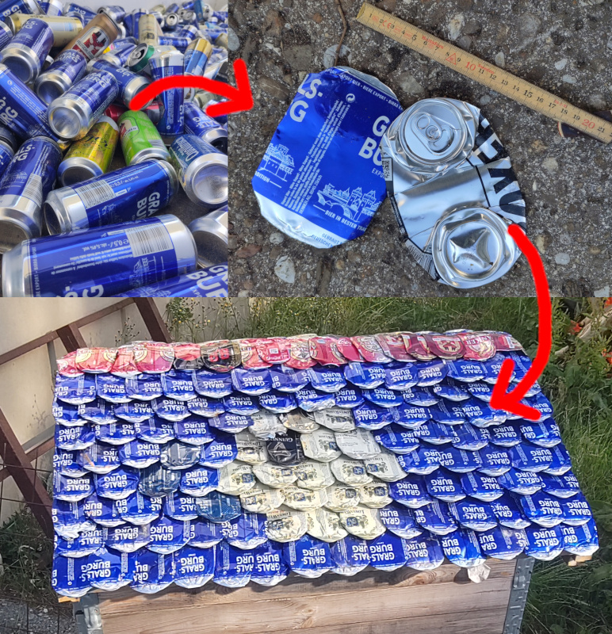

# can-dee-crush

A magical apparatus that transforms 0.5l beer cans into high-quality roof tiles
for your garden shed, a homeless shelter or a fancy earthship. At the moment,
aluminium cans are readily available and cheap (unless returnable) : at the
time of this writing, a scrap dealer in Switzerland will buy them for less than
0.4 cents/piece (yes, cents! not dollars) ; without the staples, this means
around 50¢/m² for a roof tiling that is durable, hail-proof, colorful and will
even reflect sunlight back into outer space (making them great against global
warming : since they are so cheap, they are the perfect choice to cover ice
floes and the soon-to-be-gone mountain glaciers). They also have a great social
value, since those who need homes the most are usually those who are most
depressed and have little choice but to drink the cheapest beer available ; in
a near future they will even replace *Pokemon*© and *Magic : The Gathering*©
cards (which are no way as durable nor useful) : some rare colorful patterns
will *obviously* become collectibles and it will be very hype to display them
proudly on a creepy alley shelter, turning that very same alley into something
so much better than London's *Tate Modern* or New York's *Ultimate Museum Of
Modern Art*. The prophecy will then be fulfilled as *“those who are last now
will be first then, and those who are first will be last”* (Matthew 20:16) and
even *Holy Elon* will be out-of-the-game because there is no way he can catch
up with drinking that much (and there are no breweries on Mars).

Nominal transformation rate was set at 1bps[^bps] or some 86400 tiles per day,
that means you need to drink a little over 43 cubic meters of beer in just 24
hours in order to saturate the device (that's almost 16 million liters each
year) ; therefore, if the entire world beer consumption was to come out of 50cl
cans, only 125 of such devices would be required to transform these cans into
roughly 25 km² of roof surface each year but that's OK because at the current
rate of alcoholism it would take a little more than twenty thousand years to
cover the entire surface of the earth.

In practice and since the real crushing action takes place during 60° of a full
revolution, operation will be smoothened with a 6-cylinder *can-dee-crush*.
Preliminary data suggests the rate can be raised to 1.6-1.8 bps, increasing the
throughput by a factor 10 ; since only a fraction of the beer flows through
50cl cans, it can be assumed that a single machine would be sufficient to deal
with the entire world's production. Moreover, by properly serializing the input
channel, a capacity of roughly 100 cans/second[^100] is probably a reasonable
goal (but then there wouldn't be enough such cans produced worldwide)

Cheers!

[^bps]: beer per second
[^100]: that is over 2.6 metric tons/hour and over 3 hectares of roof

## Requirements

### Hardware

**Lots** of beer cans

### Software

https://github.com/petaflot/scadlib
