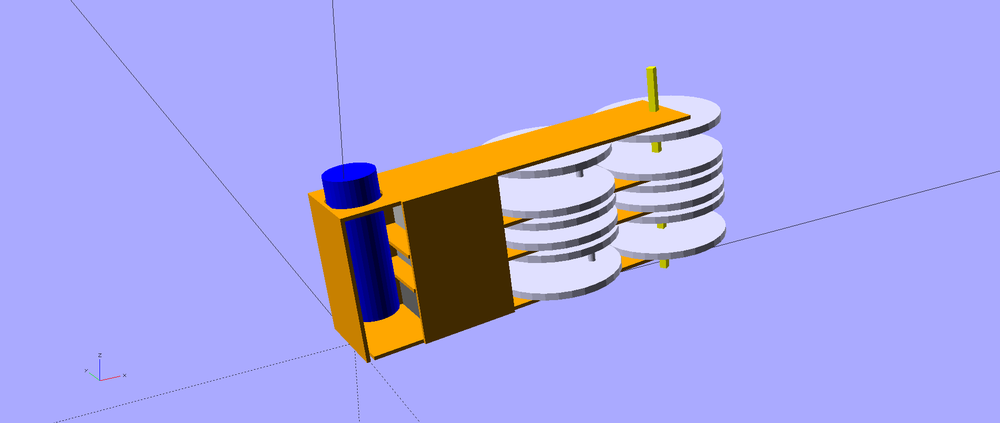

# can-dee-crush

A magical apparatus that transforms 0.5l beer cans into high-quality
tiles for your garden shed

Nomainal transformation rate is set at 1bps[^bps] or some 86400 tiles per day, that
means you need to drink a little over 43 cubic meters of beer in just 24 hours
in order to saturate the device (that's almost 16 million liters each year) ;
therefore, if the entire world beer consumption was to come out of 50cl cans,
only 125 of such devices would be required to transform these cans into roughly
25 km² of roof surface each year but that's OK because at the current rate of
alcoholism it would take a a little more than twenty thousand years to cover
the entire surface of the earth.

In practice and since the real crushing action takes place during 60° of a full
revolution, operation will be smoothened with a 6-cylinder *can-dee-crush*.
Preliminary data suggests the rate can be raised to 1.6-1.8 bps, increasing the
throughput by a factor 10 ; since only a fraction of the beer flows through
50cl cans, it can be assumed that a single machine would be sufficient to deal
with the entire world's production.

Cheers!

[^bps]: beer per second

## Requirements

### Software

https://github.com/petaflot/scadlib
