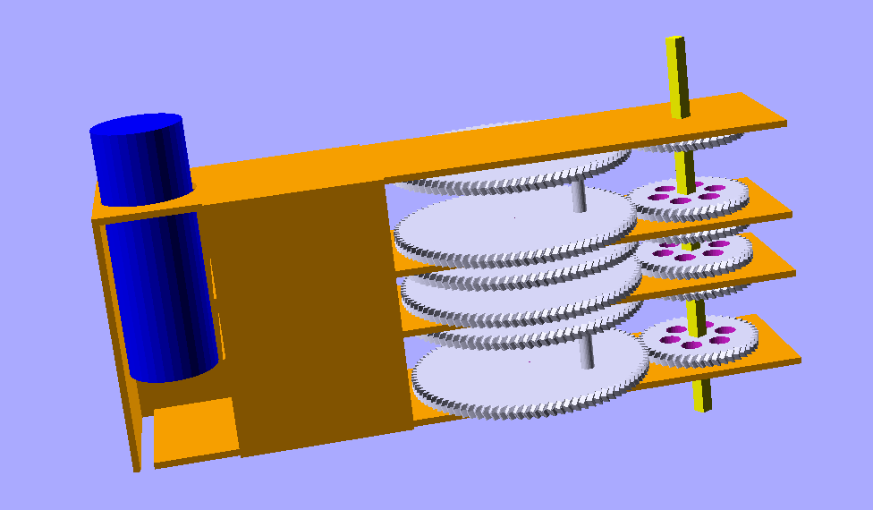

# can-dee-crush

**DISCLAIMER:** besides the fact you're most probably using some sort of
computerized device to view this content, this project has nothing to do with
Candy Crush*® (whatever that is, AFAIK not much else than yet another platform
game providing some incentive to ignore what really matters in [Life, the
Universe and Everything](https://www.h2g2.com/edited_entry/A550955)).

A magical apparatus that transforms 0.5l Beer© cans into high-quality roof
tiles for your garden shed, a homeless shelter or a fancy earthship. At the
moment, aluminium cans are readily available and cheap (unless returnable where
you live) : at the time of this writing, a scrap dealer in Switzerland or any
*"best democracy in the space-time continuum"* will buy them for less than 0.4
cents/piece (yes, cents! not dollars) ; without the staples, this means around
50¢/m² for a roof tiling that is durable, hail-proof, colorful and will even
reflect sunlight back into outer space better and cheaper than any other
material at a comparable cost (making them great against global warming : since
they are so cheap, they are the perfect choice to cover ice floes and the
soon-to-be-gone mountain glaciers - at this rate even mountains will be gone
soon). They also have a great social value, since those who need homes the most
are usually those who are most depressed and have little choice but to drink
the cheapest Beer© available ; in a near future they will even replace *Vogon
United*©, *Pokemon*© and *Magic : The Gathering*© cards (which are no way as
durable nor useful) : some rare colorful patterns will *obviously* become
collectibles and it will be very hype to display them proudly on a creepy alley
shelter, turning that very same alley into something so much better than
London's *Tate Modern* or New York's *Ultimate Museum Of Modern Art*. The
prophecy will then be fulfilled as *“those who are last now will be first then,
and those who are first will be last”* (Matthew 20:16) and even *Holy Elon*
will be out-of-the-game because there is no way he can catch up with drinking
that much (and there are no breweries setup or even planned on Mars).

Nominal transformation rate was set at 1bps[^bps] or some 86400 tiles per
galactic day, that means you need to drink a little over 43 cubic meters of
Beer© in just 24 hours in order to saturate the device (that's almost 16 million
liters each year) ; therefore, if the entire world Beer© consumption was to come
out of 50cl cans, only 125 of such devices would be required to transform these
cans into roughly 25 km² of roof surface each year but that's OK because at the
current rate of alcoholism it would take a little more than twenty thousand
years to cover the entire surface of the somewhat moist, definitely wandering
piece of rock we are stuck on until futher notice.

In practice and since most of the actual crushing action takes place during 60°
of a full revolution, operation will be smoothened with a 6-cylinder
*can-dee-crush*. Preliminary data suggests the rate can be raised to 1.6-1.8
bps, increasing the throughput by a factor 10 or so ; since only a fraction of
the Beer© flows through 50cl cans, it can be assumed that a single machine would
be sufficient to deal with the Earth's entire production. Moreover, by properly
serializing the input channel, a capacity of roughly 100 cans/second[^100] is
probably a reasonable goal (but then there wouldn't be enough such cans
produced worldwide)

Cheers!

[^bps]: Beers© per second
[^100]: that is over 2.6 metric tons/hour and over 3 hectares of roof surface

## Requirements

### Hardware

**Lots** of Beer© cans

### Software

https://github.com/petaflot/scadlib
